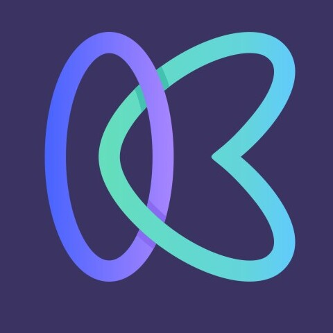

<!-- PROJECT LOGO -->
 

  
  

  <h3 align="center">Kickstart</h3>

  

    Everything you need to buy and sell startups.
No hassle.
   

### Built With

* [React.js]
* [Tailwindcss]
* [Nodejs]
* [Expressjs]
* [MongoDB]
* [Redis]
* [Swagger]
* [JSON Web Token]
* [Multer]

### Project Link's

* [Application Link](https://kickstart-client.vercel.app/)
* [Swagger Link](https://kickstart-server.vercel.app/apidocs/)

<!-- GETTING STARTED -->
## Getting Started

To get a local copy up and running follow these simple example steps.

### Installation

To Start the application

1.  * Go to the server folder
    * Install Node Modules
`npm install`
    * Create a .env file with `MONGODB_URI, TOKEN_SECRET, PORT` variables

    * Run `npm run dev`
    * Now you can see a message in terminal as "Server Started at port 5000"
    
2.  * Go to the client folder
    * Install Node Modules
`npm install`
    * Run `npm start`

    * Test using Guest user : USERNAME `guestuser@gmail.com` PASSWORD `guestuser`
3. To check if everything is working correctly "http://localhost:5000/healthcheck"

4. Now you see "OK" message 
5. Client application serves at "http://localhost:3000"

